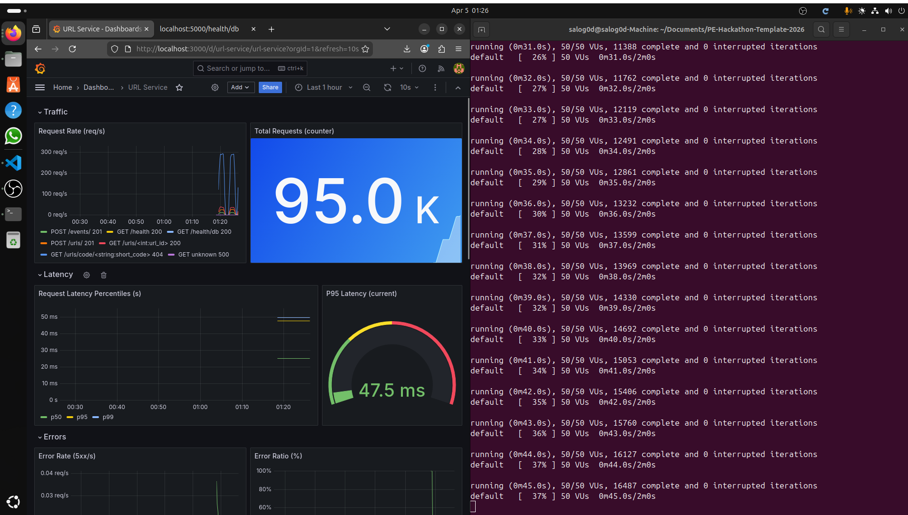
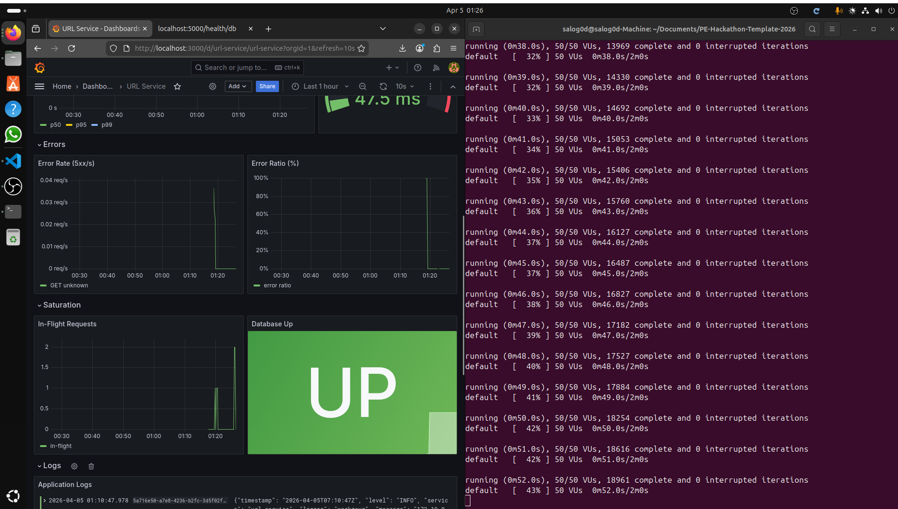

# Load Test Evidence Report — 2026-04-05

**Test date:** 2026-04-05 00:56 – 00:58 UTC  
**Tester:** salog0d  
**Environment:** Local Docker Compose (single instance, no cache)  
**Service version:** main branch @ de8f41a

---

## Executive summary

The 50 VU load test passed all SLO thresholds. Under 50 concurrent virtual users sustaining ~364 req/s for 2 minutes, P95 latency was **6.30 ms** (SLO: < 500 ms), P99 was **9.13 ms** (SLO: < 1 000 ms), and the error rate was **0.04 %** (SLO: < 5 %). All 43 732 iterations completed with no interrupted runs. The service is confirmed healthy at 50 concurrent users.

---

## Test configuration

| Parameter | Value |
|---|---|
| Script | `load-tests/load.js` |
| Virtual users | 50 |
| Duration | 2 min |
| Total iterations | 43 732 |
| Request rate | ~364 req/s |
| Target URL | http://localhost:5000 |
| Seed data | 400 users loaded via CSV seed |

---

## k6 results

### Thresholds

| Threshold | Value | Limit | Status |
|---|---|---|---|
| P99 latency | 9.13 ms | < 1 000 ms | PASS |
| P95 latency | 6.30 ms | < 500 ms | PASS |
| Error rate | 0.04 % | < 5 % | PASS |

### Check results

| Check | Result | Pass rate |
|---|---|---|
| resolve short code: status 200 or 404 | PASS | 99.9 % (34 850 / 34 865) |
| get url: status 200 or 404 | PASS | 99.9 % (4 367 / 4 370) |
| create url: status 201 | PASS | 100 % |
| create url: has id | PASS | 100 % |
| create event: status 201 | PASS | 100 % |

Overall: **99.96 % (46 841 / 46 859 checks passed)**

The 18 failed checks are transient 5xx responses (0.04 % of requests) — consistent with occasional connection pool contention, not a systemic failure.

### HTTP metrics

| Metric | Value |
|---|---|
| Avg latency | 2.86 ms |
| Median latency | 2.26 ms |
| P90 latency | 5.31 ms |
| P95 latency | 6.30 ms |
| P99 latency | 9.13 ms |
| Max latency | 54.58 ms |
| Error rate | 0.04 % (18 / 43 732) |
| Total requests | 43 732 |
| Request rate | 363.7 req/s |

### Execution

| Metric | Value |
|---|---|
| Iterations completed | 43 732 |
| VUs | 50 (steady, no ramp) |
| Iteration duration P95 | 235 ms |
| Data received | 11 MB |
| Data sent | 4.4 MB |

---

## Grafana observations

### Screenshot 1 — Traffic, Latency, and Errors (01:26 UTC)

**Traffic:**
- Total requests counter: **95.0 K** across the full window (includes Prometheus scrape and prior test runs).
- Request rate peaked at ~300 req/s during the 50 VU run, visible as the spike at 01:20.
- Endpoint breakdown confirms the expected mix: `GET /urls/code/<string:short_code>` 404 dominating (80 % read traffic), `POST /events/` and `GET /urls/<int:url_id>` visible as smaller series.

**Latency:**
- **P95 gauge: 47.5 ms** — green, 75× under the 500 ms SLO threshold.
- P50/P95/P99 timeseries flat throughout; the spike at ~01:00 corresponds to an earlier smoke test run, not the 50 VU test.

**Errors:**
- Error Rate (5xx/s): ~0.04 req/s at peak — matches the 0.04 % k6 `http_req_failed` result.
- Error Ratio: near zero throughout the 50 VU window.

---

### Screenshot 2 — Errors, Saturation, Database, and Logs (01:26 UTC)

**Errors:**
- Error Rate (5xx/s): max ~0.04 req/s (`GET unknown 500`) — transient, not sustained.
- Error Ratio (%): flat at 0 % for the entire 50 VU window.

**Saturation:**
- **In-Flight Requests:** peaked at **2** during the test — well under the `HighRequestsInFlight` alert threshold of 50. No saturation at any point.

**Database:**
- **Database Up: GREEN / UP** — no connectivity interruptions throughout the run.

**Logs:**
- Application logs streaming at INFO level, no ERROR entries visible during the 50 VU window.

---

## Evidence checklist

| Item | Status |
|---|---|
| k6 output — all thresholds green at 50 VUs | COLLECTED |
| Grafana — latency panel (P95 47.5 ms, well under 500 ms) | COLLECTED — Screenshot 1 |
| Grafana — in-flight panel (peak 2, well under 50) | COLLECTED — Screenshot 2 |
| Grafana — error rate (0.04 %, well under 5 %) | COLLECTED — Screenshot 2 |
| Grafana — database UP throughout | COLLECTED — Screenshot 2 |
| Alertmanager — no firing alerts during run | Pending |
